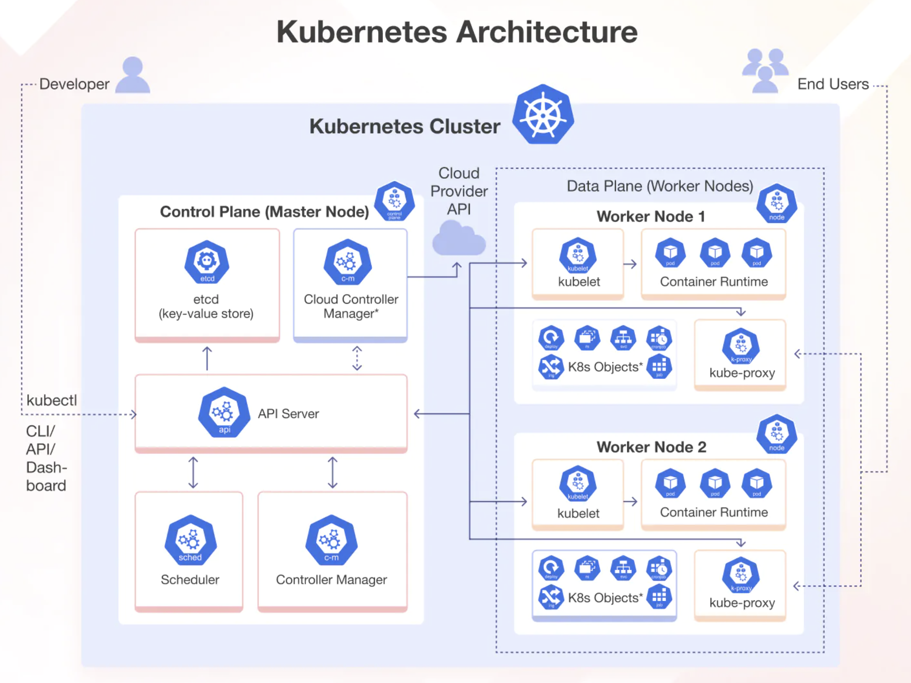
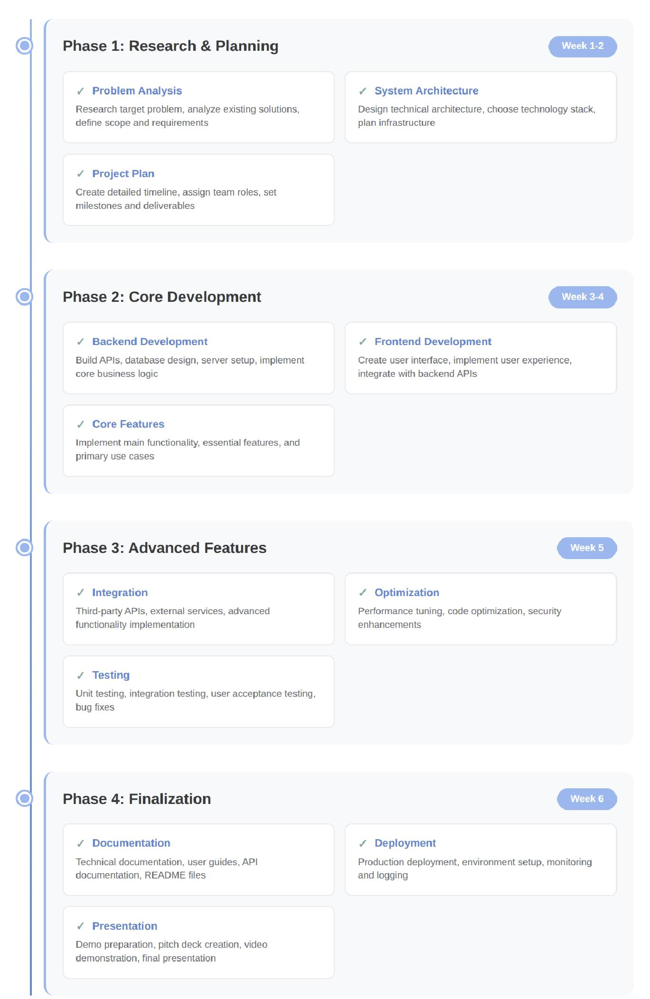

# Infosys Global Hackathon 2025 - Template Repository
## When the World is your Client

[](https://www.infosys.com/) [](https://github.com/Infosys-Global-Hackathon/GlobalHackathonSample) [](https://sdgs.un.org/) [](https://github.com/Infosys-Global-Hackathon/GlobalHackathonSample/generate) [](https://github.com/Infosys-Global-Hackathon/GlobalHackathonSample/issues) [](https://github.com/Infosys-Global-Hackathon/GlobalHackathonSample/pulls)

**Code for a cause. Build for the world.**

Welcome to the **official template repository** for the Infosys Global Hackathon 2025! This template is designed to help you create a professional, well-documented project that addresses humanity's greatest challenges through the lens of UN's Sustainable Development Goals (SDGs).

This #TechForGood initiative brings together tech enthusiasts, students, and industry professionals to create open-source, cloud-native solutions that make a meaningful impact on society and the environment.

> 🚀 **Ready to start your project?** Click the **"Use this template"** button above to create your own repository!

---

# [Your Project Name] - Solution for Sustainable Development

> 💡 **Template Instructions**: Replace the content in brackets with your actual project information. Remove this instruction block when ready.

## Table of Contents

- [🎯 Project Overview](#-project-overview)
  - [SDG Challenge Addressed](#sdg-challenge-addressed)
  - [Our Solution](#our-solution)
  - [Impact Statement](#impact-statement)
- [⚙️ Technical Implementation](#️-technical-implementation)
  - [Technology Stack](#technology-stack)
  - [System Architecture](#system-architecture)
  - [Cloud-Native & CNCF Integration](#cloud-native--cncf-integration)
- [🚀 Solution Components](#-solution-components)
  - [Working Prototype](#working-prototype)
  - [Technical Documentation](#technical-documentation)
  - [Impact Analysis](#impact-analysis)
- [📖 Getting Started](#-getting-started)
  - [Prerequisites](#prerequisites)
  - [Installation](#installation)
  - [Usage](#usage)
- [🤝 Contributing](#-contributing)
- [👥 Contributors](#-contributors)
- [🙏 Acknowledgments](#-acknowledgments)

---

## 🎯 Project Overview

### SDG Challenge Addressed

**🎯 [Replace with your chosen UN SDG(s) - e.g., SDG 3: Good Health and Well-being]**

*Describe the specific Sustainable Development Goal(s) your solution addresses. Explain why this challenge is critical and how it aligns with global sustainability objectives.*

**Example:**
> This project addresses **SDG 3: Good Health and Well-being** by creating an AI-powered healthcare accessibility platform that bridges the gap between rural communities and quality medical care, ultimately contributing to universal health coverage.

### Our Solution

**🚀 [Replace with your solution name and brief description]**

*Provide a compelling overview of your solution in 2-3 sentences. Focus on the core problem you're solving and your innovative approach.*

**Example:**
> **HealthBridge AI** is a cloud-native telemedicine platform that uses AI-powered diagnosis assistance and blockchain-secured patient records to deliver quality healthcare to underserved communities through mobile-first interfaces and low-bandwidth optimization.

### Impact Statement

*Detail the potential social, economic, or environmental impact of your solution. Include:*

- **🎯 Target Beneficiaries**: [e.g., Rural populations in developing countries, expecting to reach 50,000+ individuals]
- **📊 Expected Outcomes**: [e.g., 40% reduction in travel time to access healthcare, 60% faster diagnosis]
- **📈 Measurable Impact Metrics**: [e.g., Number of consultations completed, Patient satisfaction scores, Cost savings]
- **🌱 Long-term Sustainability Vision**: [e.g., Integration with national health systems, partnership with NGOs]

---

## ⚙️ Technical Implementation

### Technology Stack

**Core Technologies Used:**

| Category | Technologies | Purpose |
|----------|-------------|---------|
| **🤖 AI/ML** | [e.g., TensorFlow, PyTorch, scikit-learn] | [AI frameworks and models used] |
| **🌐 Backend** | [e.g., Node.js, Python FastAPI, Go] | [Server-side implementation] |
| **⚡ Frontend** | [e.g., React, Vue.js, Flutter] | [User interface development] |
| **🔗 Beckn Protocol** | [If applicable] | [Digital commerce integration] |
| **⛓️ Blockchain** | [e.g., Ethereum, Hyperledger] | [Decentralized features] |
| **☸️ CNCF Tools** | [e.g., Kubernetes, Helm, Istio] | [Cloud-native deployment] |
| **☁️ Cloud Platform** | [e.g., AWS, Azure, GCP] | [Infrastructure and services] |
| **📊 Databases** | [e.g., PostgreSQL, MongoDB, Redis] | [Data storage and management] |

*Replace the above with your actual technology stack and provide details on how each technology contributes to your solution.*

### System Architecture



**Architecture Overview:**
*Provide a clear explanation of your system architecture, including:*

1. **🖥️ User Interface Layer**
   - Web/mobile applications
   - User authentication and authorization
   - Responsive design for multiple devices

2. **⚡ API Gateway & Services**
   - RESTful/GraphQL APIs
   - Microservices architecture
   - Load balancing and rate limiting

3. **🧠 Processing & AI Layer**
   - Machine learning models
   - Data processing pipelines
   - Real-time analytics

4. **💾 Data Storage & Management**
   - Primary databases
   - Caching layers
   - Backup and disaster recovery

5. **🔗 External Integrations**
   - Third-party APIs
   - Payment gateways
   - Notification services

### Cloud-Native & CNCF Integration

*Describe how your solution leverages cloud-native technologies:*

| CNCF Category | Tools & Technologies | Implementation |
|---------------|---------------------|----------------|
| **🐳 Container Runtime** | Docker, containerd | [How containers are used] |
| **☸️ Orchestration** | Kubernetes, Helm | [Deployment and scaling] |
| **🌐 Service Mesh** | Istio, Linkerd | [Service communication] |
| **📊 Observability** | Prometheus, Grafana, Jaeger | [Monitoring and tracing] |
| **🚀 CI/CD** | Tekton, Argo CD | [Deployment pipelines] |
| **💾 Storage** | Rook, Longhorn | [Persistent data storage] |
| **🔐 Security** | Falco, OPA Gatekeeper | [Security policies] |

---

## 🚀 Solution Components

### Working Prototype

**🌐 Live Demo**: [Insert your demo link here - e.g., https://your-project.vercel.app]

**📱 Demo Credentials** (if authentication required):
```
Username: demo@example.com
Password: demo123
```

*Describe your working prototype:*
- ✅ **Core Functionality**: [List main features implemented]
- 🎨 **User Interface**: [Describe the user experience]
- ⚡ **Performance**: [Key performance metrics]
- 📊 **Analytics**: [Usage statistics or insights]

**🎥 Demo Video**: 
[](YOUR_DEMO_VIDEO_LINK)

### Technical Documentation

**📚 Comprehensive Documentation:**

| Document Type | Description | Link |
|---------------|-------------|------|
| 🏗️ **System Architecture** | Detailed technical design | [Architecture Doc](./docs/DESCRIPTION.md) |
| 📡 **API Documentation** | All endpoints and integrations | [API Docs](./docs/api/) |
| 🚀 **Deployment Guide** | Step-by-step setup instructions | [Deploy Guide](./docs/deployment/) |
| 👤 **User Manual** | How to use the solution | [User Guide](./docs/user-guide/) |
| 💻 **Developer Guide** | Contributing and development setup | [Dev Guide](./CONTRIBUTING.md) |

### Impact Analysis

**📊 Measurable Impact:**

#### Quantitative Metrics
- 📈 **User Adoption**: [e.g., 1,000+ active users in pilot phase]
- ⏱️ **Efficiency Gains**: [e.g., 60% reduction in processing time]
- 💰 **Cost Savings**: [e.g., $50,000 annual savings for target organizations]
- 🌍 **Geographic Reach**: [e.g., Deployed in 5 countries across 3 continents]

#### Qualitative Benefits
- 🏥 **Healthcare**: [e.g., Improved access to medical consultations]
- 🎓 **Education**: [e.g., Enhanced learning outcomes for students]
- 🌱 **Environment**: [e.g., Reduced carbon footprint through optimization]
- 👥 **Social**: [e.g., Increased community engagement and participation]

#### Use Cases & Applications

1. **🎯 Primary Use Case**: [Describe main application scenario]
   - Target users: [Specific user groups]
   - Problem solved: [Core issue addressed]
   - Impact achieved: [Measurable outcomes]

2. **🔄 Secondary Use Cases**: [Additional applications]
   - [Use case 1]: [Brief description]
   - [Use case 2]: [Brief description]
   - [Use case 3]: [Brief description]

3. **🚀 Future Applications**: [Potential expansions]
   - [Future expansion 1]: [Vision for growth]
   - [Integration possibilities]: [Potential partnerships]
   - [Scale opportunities]: [Global expansion plans]

**📈 Project Roadmap**



---

## 📖 Getting Started

### Prerequisites

**💻 System Requirements:**
- **Operating System**: Windows 10+, macOS 10.15+, or Linux (Ubuntu 18.04+)
- **Memory**: Minimum 8GB RAM (16GB recommended)
- **Storage**: At least 10GB free space
- **Network**: Stable internet connection

**🛠️ Required Software:**
```bash
# Node.js (if using JavaScript/TypeScript)
node --version  # v16.0.0 or higher

# Python (if using Python)
python --version  # 3.8 or higher

# Docker (for containerization)
docker --version  # 20.0 or higher

# Kubernetes CLI (for deployment)
kubectl version --client  # v1.20 or higher
```

**🔧 Development Tools:**
- Git (version control)
- VS Code or your preferred IDE
- [Any specific tools for your tech stack]

### Installation

**🚀 Quick Start (5 minutes):**

1. **📥 Clone the Repository**
   ```bash
   git clone https://github.com/Infosys-Global-Hackathon/GlobalHackathonSample.git
   cd GlobalHackathonSample
   ```

2. **📦 Install Dependencies**
   ```bash
   # For Node.js projects
   npm install
   
   # For Python projects
   pip install -r requirements.txt
   
   # For Go projects
   go mod download
   ```

3. **⚙️ Environment Configuration**
   ```bash
   # Copy environment template
   cp .env.example .env
   
   # Edit configuration (add your API keys, database URLs, etc.)
   nano .env  # or use your preferred editor
   ```

4. **🗄️ Database Setup** (if applicable)
   ```bash
   # Using Docker Compose (recommended)
   docker-compose up -d postgres
   
   # Run migrations
   npm run migrate  # or your equivalent command
   ```

5. **🎉 Start the Application**
   ```bash
   # Development mode
   npm run dev
   
   # Or for Python
   python app.py
   
   # Or using Docker
   docker-compose up
   ```

### Usage

**🌐 Accessing the Application:**

| Environment | URL | Purpose |
|-------------|-----|---------|
| **Local Development** | `http://localhost:3000` | Development and testing |
| **Staging** | `https://staging.your-project.com` | Pre-production testing |
| **Production** | `https://your-project.com` | Live application |

**🎯 Key Features to Explore:**

1. **🏠 Dashboard**: Overview of key metrics and insights
   ```
   Navigate to: /dashboard
   Features: Real-time analytics, user statistics, system health
   ```

2. **🔍 Main Functionality**: [Your core feature]
   ```
   Navigate to: /[main-feature-path]
   Features: [List key capabilities]
   ```

3. **⚙️ Configuration**: System settings and preferences
   ```
   Navigate to: /settings
   Features: User preferences, API configurations, integrations
   ```

**📱 API Usage Examples:**
```bash
# Health check
curl https://your-api.com/health

# Get data (replace with your actual endpoints)
curl -H "Authorization: Bearer YOUR_TOKEN" \
     https://your-api.com/api/v1/data

# Create resource
curl -X POST \
     -H "Content-Type: application/json" \
     -H "Authorization: Bearer YOUR_TOKEN" \
     -d '{"key": "value"}' \
     https://your-api.com/api/v1/resource
```

**🐳 Docker Deployment:**
```bash
# Build and run with Docker Compose
docker-compose up --build

# Scale services
docker-compose up --scale web=3

# View logs
docker-compose logs -f
```

---

## 🤝 Contributing

We welcome contributions from developers, designers, researchers, and anyone passionate about using technology for social good! Here's how you can get involved:

### 🌟 Ways to Contribute

| Contribution Type | Description | Get Started |
|-------------------|-------------|-------------|
| 🐛 **Bug Reports** | Found an issue? Help us fix it! | [Report Bug](https://github.com/Infosys-Global-Hackathon/GlobalHackathonSample/issues/new?template=bug_report.md) |
| ✨ **Feature Requests** | Have an idea for improvement? | [Request Feature](https://github.com/Infosys-Global-Hackathon/GlobalHackathonSample/issues/new?template=feature_request.md) |
| 📝 **Documentation** | Help improve our docs | [Contribute Docs](https://github.com/Infosys-Global-Hackathon/GlobalHackathonSample/issues?q=label%3Adocumentation) |
| 💻 **Code** | Submit code improvements | [View Open Issues](https://github.com/Infosys-Global-Hackathon/GlobalHackathonSample/issues?q=is%3Aopen+is%3Aissue+label%3A%22good+first+issue%22) |
| 🎨 **Design** | UI/UX improvements | [Design Issues](https://github.com/Infosys-Global-Hackathon/GlobalHackathonSample/issues?q=label%3Adesign) |

### 🚀 Quick Start for Contributors

1. **🍴 Fork & Clone**
   ```bash
   # Fork this repository on GitHub, then:
   git clone https://github.com/YOUR_USERNAME/GlobalHackathonSample.git
   cd GlobalHackathonSample
   git remote add upstream https://github.com/Infosys-Global-Hackathon/GlobalHackathonSample.git
   ```

2. **🌿 Create a Branch**
   ```bash
   git checkout -b feature/your-amazing-feature
   # or
   git checkout -b fix/bug-description
   ```

3. **💻 Make Changes**
   - Follow our [coding standards](./docs/contributing/PULL-REQUESTS.md)
   - Add tests if applicable
   - Update documentation

4. **✅ Test Your Changes**
   ```bash
   npm test  # or your project's test command
   npm run lint  # check code style
   ```

5. **� Commit with Good Messages**
   Use descriptive commit messages following conventional commits:
   ```bash
   # Feature additions
   feat: add user authentication system
   
   # Bug fixes
   fix: resolve login redirect issue
   
   # Documentation updates
   docs: update API documentation with new endpoints
   
   # Template improvements
   feat: enhance README with architecture diagrams and GitHub integration
   ```

6. **�📤 Submit Pull Request**
   - Push to your fork: `git push origin feature/your-amazing-feature`
   - Create PR using our [template](https://github.com/Infosys-Global-Hackathon/GlobalHackathonSample/compare)

### 📋 Contribution Guidelines

- ✅ **Code Quality**: Follow established patterns and style guides
- ✅ **Testing**: Add or update tests for new functionality  
- ✅ **Documentation**: Update README and docs for any changes
- ✅ **SDG Focus**: Ensure contributions align with sustainability goals
- ✅ **Inclusive**: Use inclusive language and consider accessibility

For detailed guidelines, see our [Contributing Guide](./CONTRIBUTING.md).

### 🐛 Reporting Issues

Found a problem? We want to hear about it! 

**Before creating an issue:**
- 🔍 Search [existing issues](https://github.com/Infosys-Global-Hackathon/GlobalHackathonSample/issues) to avoid duplicates
- 📝 Use our issue templates for consistent reporting
- 🔗 Include relevant links, screenshots, or code snippets

### 💬 Community & Support

- 🗣️ **Discussions**: [GitHub Discussions](https://github.com/Infosys-Global-Hackathon/GlobalHackathonSample/discussions) for questions and ideas
- 📢 **Announcements**: Watch this repo for updates
- 📧 **Direct Contact**: See [CONTRIBUTING.md](./CONTRIBUTING.md) for maintainer contacts

---

## 👥 Contributors

This project exists thanks to all the people who contribute:

<a href="https://github.com/Infosys-Global-Hackathon/GlobalHackathonSample/graphs/contributors">
  
</a>

### 🏆 Core Team

| Contributor | Role | Expertise | Contact |
|-------------|------|-----------|---------|
| [Contributor 1] | Lead Developer | [Skills] | [GitHub/LinkedIn] |
| [Contributor 2] | Technical Lead | [Skills] | [GitHub/LinkedIn] |
| [Contributor 3] | Documentation | [Skills] | [GitHub/LinkedIn] |
| [Contributor 4] | Testing & QA | [Skills] | [GitHub/LinkedIn] |

### 🌟 Special Thanks

- All contributors who have helped improve this project
- The open-source community for inspiration and support
- Beta testers and early adopters for valuable feedback

---

## 🙏 Acknowledgments

### 🏢 Powered by Infosys
This project is part of the **Infosys Global Hackathon 2025** - a #TechForGood initiative that brings together tech enthusiasts, students, and industry professionals to solve humanity's greatest challenges.

### 🌐 Community Partners
- **Cloud Native Computing Foundation (CNCF)** - For providing cutting-edge cloud-native tools and frameworks
- **United Nations SDGs** - For providing the global framework for sustainable development

### 🎯 Our Mission
**Code for a cause. Build for the world.**

We're committed to creating solutions that make a meaningful impact on society while leveraging the latest in cloud-native, AI, and open-source technologies.

### 📞 Connect with the Community

- **Infosys Careers**: [https://www.infosys.com/careers/](https://www.infosys.com/careers/)
- **Infosys ESG**: [https://www.infosys.com/sustainability/](https://www.infosys.com/sustainability/)
- **CNCF Projects**: [https://www.cncf.io/projects/](https://www.cncf.io/projects/)
- **UN SDGs**: [https://sdgs.un.org/](https://sdgs.un.org/)

### 🏷️ Tags
`#OpportunityMatters` `#TechForGood` `#ThriveAtInfosys` `#IWOL`

---

## 🏆 Recognition & Impact

This project aims to create meaningful change through technology. Success is measured by:

- **🌍 Social Impact**: Number of lives positively affected
- **🌱 Environmental Benefit**: Measurable sustainability improvements
- **👥 Community Adoption**: Active users and contributors
- **📚 Open Source Contribution**: Code reused by other projects
- **🎯 SDG Advancement**: Progress toward UN Sustainable Development Goals

**Our goal: Code for a cause. Build for the world.**

---

### 📜 License

This project is licensed under the Apache 2.0 License - see the [LICENSE](LICENSE) file for details.

### 📧 Contact

For questions about this project, please:
- **Open an Issue**: [Create a GitHub issue](https://github.com/Infosys-Global-Hackathon/GlobalHackathonSample/issues/new) for bugs or feature requests
- **Discussions**: Use [GitHub Discussions](https://github.com/Infosys-Global-Hackathon/GlobalHackathonSample/discussions) for general questions
- **Email**: [Refer to CONTRIBUTING.md for maintainer contacts]
- **Template Issues**: Use our [template improvement](https://github.com/Infosys-Global-Hackathon/GlobalHackathonSample/issues/new?template=template_improvement.md) template for template-specific feedback

---

*Copyright © 2025 [Your Project Name]. Open source project inspired by Infosys Global Hackathon 2025.*

**🚀 Ready to make an impact? [Use this template](https://github.com/Infosys-Global-Hackathon/GlobalHackathonSample/generate) to start your own project!**
